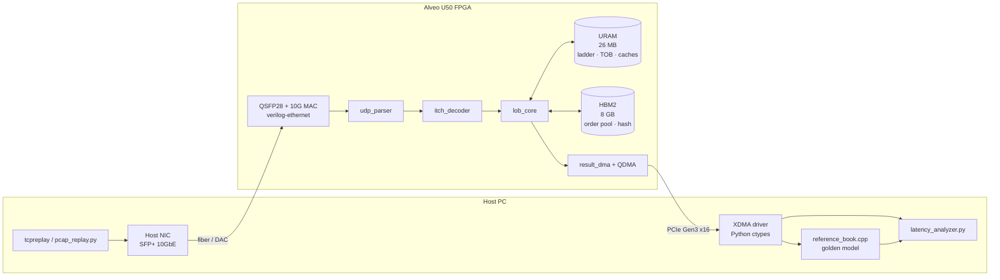
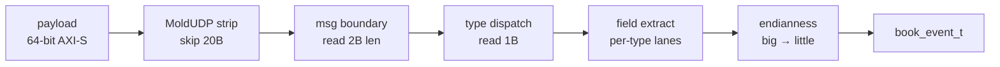
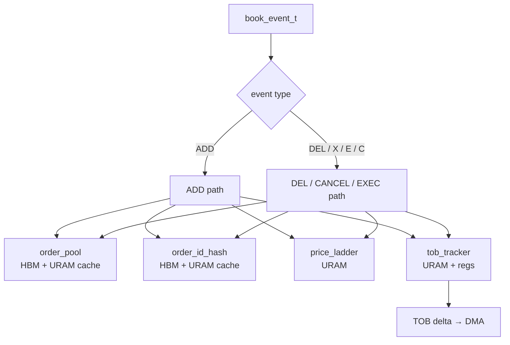

# Nanobook — Hardware L3 Limit Order Book with ITCH 5.0 Decoder on Alveo U50

**Status:** Design draft, awaiting implementation plan
**Date:** 2026-04-23
**Target hardware:** Xilinx Alveo U50 (XCU50), used, ~$2–3k
**Timeline:** ~12 months
**Repo:** new — separate from OpenSoC

---

## 1. Project summary

Build a research prototype that ingests real NASDAQ ITCH 5.0 market data over 10 GbE and maintains
a full L3 (per-order) limit order book for the top 100 NASDAQ-listed symbols entirely on FPGA.
The book emits top-of-book (TOB) deltas over PCIe DMA for host-side analysis.

**Headline claim (project deliverable):**

> *"Frame-to-top-of-book-update latency p99.99 ≤ 500 ns on 100 symbols, bit-exact against a
> reference C++ book on three pinned NASDAQ ITCH 5.0 trading days."*

The design pairs a low-latency claim with a correctness claim so the result is both impressive and reproducible.

### 1.1 Non-goals

Explicitly out of scope:

- Matching engine (we follow an exchange feed; we don't create executions)
- Pre-trade risk checks
- Order entry path (OUCH encoder, TCP offload, order gateway)
- Strategy / alpha / signal generation
- Multi-exchange feeds (CME MDP, CBOE PITCH, etc.)
- IEEE 1588 / PTP hardware timestamping
- Support for more than the top-100 NASDAQ symbols by volume

### 1.2 Key scoping decisions (recap of brainstorm)

| Decision | Choice | Why |
| --- | --- | --- |
| Book depth | **L3 (per-order)** | ITCH is natively L3; strongest research claim |
| Symbol count | **~100** | Top-volume slice; stresses memory design without HBM infrastructure eating the project |
| Pipeline scope | **Decoder + Book** (no strategy, no order emit) | 11/12 months spent on core IP, not demo theatre |
| Input path | **10GbE off the wire** | Makes the latency claim honest |
| Board | **Alveo U50** | Modern, HBM2, 2× QSFP28, ~$2k used |
| Memory architecture | **URAM + HBM hybrid** | 100-symbol state doesn't fit URAM alone; hybrid keeps hot path single-cycle |
| RISC-V CPU | **None** | PCIe host is the control plane |
| Input source | **NASDAQ TotalView-ITCH 5.0 pcaps** | Real exchange data, free, reproducible |
| Success claim | **Latency (p99.99) + bit-exact correctness** | Latency for the story, correctness for the trust |

---

## 2. System architecture

Two cooperating domains: a host PC running the driver, reference book, and analysis, and the
Alveo U50 running the hardware pipeline.

### 2.1 Domain split



### 2.2 RTL top-level modules (Alveo side)

| Module | Role |
| --- | --- |
| `eth10g_wrapper.sv` | Open-source 10GbE MAC (Alex Forencich `verilog-ethernet`) + PCS/PMA — avoids Xilinx IP licensing friction |
| `udp_parser.sv` | Strips Ethernet / IPv4 / UDP headers, emits payload AXI-Stream |
| `itch_decoder.sv` | MoldUDP64 + ITCH 5.0 frame-to-event decoder |
| `lob_core.sv` | Book top-level; instantiates the four sub-modules below |
| `order_pool.sv` | HBM-backed order-record store with URAM write-through cache |
| `order_id_hash.sv` | order-ID → slot-index hash, HBM-backed with URAM probe cache |
| `price_ladder.sv` | Per-symbol price-level state in URAM, ±4K-tick sliding window |
| `tob_tracker.sv` | Best-bid / best-ask registers, active-level bitmap, pipelined CLZ |
| `result_dma.sv` | Packs TOB deltas + event timestamps into DMA frames |
| `xdma_wrapper.sv` | Xilinx XDMA IP wrapper for host PCIe |

### 2.3 Clocks

- **10G MAC RX/TX (XGMII):** 156.25 MHz
- **User logic (book core, DMA):** 250 MHz (target; fallback 200 MHz)
- **ITCH decoder:** 400 MHz (M03 OOC verified; async FIFO to user-logic domain)
- **HBM AXI:** 450 MHz (HBM IP default)
- **PCIe / XDMA:** 250 MHz (Xilinx XDMA default for Gen3 x16)
- **CDCs:** asynchronous FIFOs between MAC and user logic; AXI clock converters on HBM and PCIe boundaries

---

## 3. ITCH 5.0 decoder

**Status:** implemented in M03. RTL under `hw/ip/itch_decoder/` (13 SV files: top, six pipeline
stages, five per-type extractors, and the `book_event_pkg` package). Vivado OOC synth meets
400 MHz on xcu50 (WNS +0.736 ns at 2.5 ns period); detailed spec at
`docs/superpowers/specs/2026-04-26-nanobook-m03-itch-decoder-design.md`.

### 3.1 Wire format

Each 10GbE UDP packet contains a MoldUDP64 wrapper followed by one or more ITCH messages:

```text
┌──────────┬──────────┬──────────┬──────────────┬──────────────┬─────┐
│ Ethernet │   IPv4   │   UDP    │  MoldUDP64   │  ITCH msg 0  │ ... │
│   14 B   │   20 B   │   8 B    │  20 B header │  2B len+body │     │
└──────────┴──────────┴──────────┴──────────────┴──────────────┴─────┘
```

`udp_parser.sv` strips L2/L3/L4 upstream of the decoder. The decoder owns everything from MoldUDP inward.

MoldUDP64 sequence-gap recovery (retransmit requests, re-request servers) is **out of scope**
— the pcap-replay regression uses curated, gap-free captures. A sequence-number mismatch bumps
a counter and forwards the packet; it does not halt the pipeline.

### 3.2 Pipeline



Six pipeline stages, one message per cycle steady-state. Target latency 3–5 cycles per message
(≈7.5–12.5 ns at 400 MHz). Decoder OOC Fmax measured 400 MHz; integration into the 250 MHz
user-logic domain uses an async FIFO at the decoder→`lob_core` boundary. Throughput ceiling
~400 M events/s, well above 10GbE peak burst (~50 M msg/s).

### 3.3 Message-type handling

Only six message types touch the book fast path. Everything else forwards slow-path to the host
over a secondary DMA channel or is dropped with a counter bump.

| Type | Name | Book action | Path |
| --- | --- | --- | --- |
| A, F | Add Order (plain / with MPID) | Insert at price level | **fast** |
| E | Order Executed | Decrement size | **fast** |
| C | Order Executed w/ Price | Decrement + trade log | **fast** |
| X | Order Cancel (partial) | Decrement size | **fast** |
| D | Order Delete (full) | Remove order | **fast** |
| U | Order Replace | Split into DELETE + ADD | **fast** |
| R | Stock Directory | Symbol table population | slow → host |
| S, H, Y, L, P, Q, B, I, N | System events, trades, NOII, etc. | None | slow / pass-through |

**Replace is split in the decoder**, not the book. The book never sees a replace primitive
— only ADD / CANCEL / DELETE / EXEC. This shrinks the book state machine.

### 3.4 Output event format

```systemverilog
typedef struct packed {
  logic [3:0]  type;         // ADD / CANCEL / DELETE / EXEC / EXEC_PX
  logic [63:0] order_id;
  logic [15:0] symbol_id;    // stock_locate from ITCH
  logic        side;         // 0 = bid, 1 = ask (valid only for ADD)
  logic [31:0] price;        // u32 fixed-point, 4 decimals
  logic [31:0] shares;
  logic [47:0] ingress_ts;   // MAC-RX timestamp counter
} book_event_t;
```

`ingress_ts` is captured at CMAC-RX by a 48-bit free-running counter at 250 MHz (4 ns tick,
~13-day rollover). It accompanies the event all the way to the DMA ring so the host can compute
frame-to-TOB-update latency directly.

**Canonical C++ form:** `sw/refbook/include/refbook/book_event.h`. At M3 freeze, the
SystemVerilog package file `hw/ip/itch_decoder/book_event_pkg.sv` must mirror the C++
header field-for-field (same offsets, same enum values). A CI diff check or codegen
script maintains the invariant.

---

## 4. L3 book core

The book core consumes `book_event_t` and maintains the full L3 state for 100 symbols.
It emits a TOB delta whenever best-bid or best-ask changes for any symbol.

### 4.1 Sub-modules



| Sub-module | Memory | Contents |
| --- | --- | --- |
| `order_pool` | HBM + 1 MB URAM cache | 7M slots × 32 B = 224 MB: `{order_id, shares, prev_ptr, next_ptr, flags}` |
| `order_id_hash` | HBM + 1.5 MB URAM cache | 10M-slot open-addressing hash; hot-path probe depth ≤ 4, overflow escalates to host |
| `price_ladder` | URAM | 100 syms × 2 sides × 4K ticks × 16 B = 13 MB: `{head, tail, agg_size, order_count}` |
| `tob_tracker` | URAM + regs | 100 syms × 2 sides × 4K-bit bitmap + `{best_bid, best_ask}` regs |

**Total state:** ~350 MB across HBM (well under 8 GB); URAM usage ~16 MB
(ladder + bitmaps + caches), fits U50's ~22.5 MB URAM with ~6 MB headroom for cache tuning.

### 4.2 Memory architecture

```text
┌─────────────────────────────────────────────────────────┐
│                      URAM (~22 MB)                      │
│  ┌─────────────┐ ┌──────────┐ ┌────────┐ ┌───────────┐  │
│  │ price_ladder│ │ tob_bmap │ │ pool$  │ │   hash$   │  │
│  │   ~13 MB    │ │ ~100 KB  │ │  1 MB  │ │  1.5 MB   │  │
│  └─────────────┘ └──────────┘ └────────┘ └───────────┘  │
└─────────────────────────────────────────────────────────┘
                 ↑  hot path: URAM-only           ↓ miss
┌─────────────────────────────────────────────────────────┐
│             HBM2 (allocated ~350 MB of 8 GB)            │
│  ┌───────────────────┐    ┌──────────────────────────┐  │
│  │    order_pool     │    │      order_id_hash       │  │
│  │      224 MB       │    │          120 MB          │  │
│  └───────────────────┘    └──────────────────────────┘  │
└─────────────────────────────────────────────────────────┘
```

**URAM caches** are direct-mapped for single-cycle hit detection. `order_pool` cache is
write-through; `order_id_hash` probe cache is read-mostly with line-replace on miss. Cache hit
is expected >99% on real ITCH due to Zipfian order-access distribution.

### 4.3 Hot paths

**ADD order** — 8 logical steps pipelined into a 4-cycle critical path (URAM-hit case; HBM write-backs are non-blocking):

1. Pop `slot_idx` from order_pool free-list (URAM)
2. Write record to order_pool cache (URAM + HBM write-back)
3. Insert `(order_id, slot_idx)` into hash (URAM cache + HBM write-back)
4. Read price-level state: `{head, tail, agg_size, count}` (URAM)
5. Link new slot: update `old_tail.next = new`, `new.prev = old_tail`; tail ← new
6. Increment `agg_size`, `order_count`
7. Set bitmap bit for this level; if price improves best, update TOB register
8. Emit TOB delta if best changed

**DELETE order** — 8 logical steps pipelined into a 5-cycle critical path (URAM-hit case);
each HBM miss on the hash or pool read adds ~100 ns, accounted for in the tail budget (§4.6):

1. Hash lookup `order_id → slot_idx` (URAM cache; else HBM probe)
2. Read order record `{prev, next, price, side, shares}` (URAM cache; else HBM)
3. Splice: `prev.next ← next`; `next.prev ← prev`
4. Decrement price-level `agg_size`, `order_count`
5. If `order_count == 0`: clear bitmap bit
6. If deleted level was best: CLZ on bitmap → new best; update TOB register; emit delta
7. Push `slot_idx` back to free-list
8. Remove from hash (URAM + HBM)

**CANCEL_PARTIAL and EXEC** are a subset of DELETE: decrement `shares`; if shares reach zero, fall into the DELETE path.

### 4.4 Sliding price window

Each symbol has a `midprice[sym]` register. The URAM ladder for that symbol covers
`midprice ± 2K` ticks (±$20 at penny ticks — covers normal intraday moves for most top-100
names). A rolling EMA updates the midprice. If an incoming price falls outside the window, a
**rebase** operation:

1. Pauses the affected symbol for ~100 cycles
2. Reads all active ticks in the window (bounded by bitmap population)
3. Translates them to new window offsets
4. Resumes

Rebases are deliberately benchmarked on the book-quake regression day so we know the worst-case stall behavior.

### 4.5 Next-best discovery

When the best bid level empties on a DELETE, we don't scan — we use the 4K-bit active-level bitmap:

- Clear the bit for the empty level
- Use a pipelined tree CLZ (64×64 arrangement, 2 stages) to find the highest set bit
- Return its tick offset; compute new best price

Deterministic 2 cycles regardless of book shape.

### 4.6 Latency budget

| Stage | Cycles (@250 MHz) | ns |
| --- | --- | --- |
| MAC RX → user logic | 3 | 12 |
| UDP parser | 2 | 8 |
| ITCH decoder | 5 | 20 |
| Book core hot path (ADD) | 4 | 16 |
| Book core hot path (DELETE) | 5 | 20 |
| Result formatter + DMA head | 3 | 12 |
| **Hot-path total (ADD)** | **17** | **~70 ns** |
| **Hot-path total (DELETE)** | **18** | **~72 ns** |

**p99.99 tail budget:** dominated by HBM hash-probe misses. The hash on the hot path is bounded
to ≤ 4 probes; chains beyond that escalate to a host slow-path (tracked via a stats counter,
not counted against the p99.99 claim). Hard worst case on the hot path is therefore ~70 ns
pipeline + 4 × ~100 ns HBM ≈ 470 ns, under the 500 ns target. Under real ITCH with Zipfian
order-access distribution, expected p99.99 is 1–2 HBM reads, ~200–300 ns.

---

## 5. Memory map and interfaces

### 5.1 PCIe register map (host → FPGA control)

BAR0, 64 KB. 32-bit registers unless noted.

| Offset | Name | R/W | Description |
| --- | --- | --- | --- |
| `0x0000` | `ID` | R | Fixed magic `0x4E414E4F` ("NANO") |
| `0x0004` | `VERSION` | R | `{major[15:0], minor[15:0]}` |
| `0x0010` | `CONTROL` | RW | See CONTROL bit table below |
| `0x0014` | `STATUS` | R | See STATUS bit table below |
| `0x0020` | `GIT_SHA_LO` | R | Low 32 bits of HEAD commit SHA baked at synthesis |
| `0x0024` | `GIT_SHA_HI` | R | High 32 bits of HEAD commit SHA |
| `0x0028` | `SYMBOL_MAP_ADDR` | RW | HBM pointer to stock_locate → sym_idx table (populated M6+) |
| `0x0100` | `STATS_*` | R | Per-pipeline counters (events in/out, drops, HBM misses, rebases) |
| `0x0200` | `TOB_RING_BASE` | RW | Host DMA ring base address |
| `0x0204` | `TOB_RING_SIZE` | RW | Ring size in entries (power of 2) |
| `0x0208` | `TOB_RING_HEAD` | RW | Host-updated consumer head |
| `0x020C` | `TOB_RING_TAIL` | R | FPGA-updated producer tail |
| `0x0300` | `CLOCK_NS` | R | Free-running 48-bit timestamp counter (low / high split) |

**CONTROL bits (0x0010, RW, 7 bits implemented):**

| Bit | Name | Description |
| --- | --- | --- |
| `[0]` | `ENABLE` | Pipeline enable |
| `[1]` | `RESET` | Pipeline reset (active high) |
| `[2]` | `PAUSE` | Pipeline pause |
| `[3]` | `LED0` | GPIO LED 0 (diagnostic) |
| `[4]` | `HBM_SMOKE_GO / LED1` | Trigger HBM smoke test; also drives LED 1 |
| `[5]` | `LED2` | GPIO LED 2 (diagnostic) |
| `[6]` | `LED3` | GPIO LED 3 (no physical pin on U50; silently dropped) |

**STATUS bits (0x0014, R):**

| Bit | Name | Description |
| --- | --- | --- |
| `[0]` | `HBM_READY` | HBM IP APB initialisation complete |
| `[1]` | `ETH10G_READY` | 10G PHY `rx_block_lock` asserted |
| `[7:2]` | — | Reserved, reads 0 |
| `[8]` | `HBM_SMOKE_DONE` | Smoke test completed |
| `[9]` | `HBM_SMOKE_ERR` | Smoke test detected any error |
| `[31:10]` | — | Reserved, reads 0 |

**U50 hardware notes (frozen at M01, do not change without a spec PR):**

- QSFP management (`modsell`, `resetl`, `modprsl`, `intl`, `lpmode`) is routed via the
  satellite controller (MSP430 / CMS), not direct FPGA I/O. These signals are not top-level
  FPGA ports.
- `hbm_cattrip` (J18, LVCMOS18) must be driven low at all times. Driving it high signals
  catastrophic over-temperature and forces a board power-off; Vivado DRC PPURQ-1 enforces this.
- HBM reference clock source: 100 MHz board oscillator at BB18/BC18 (LVDS). The same clock
  as Corundum's `clk_100mhz_1`.
- U50 exposes exactly 3 user LEDs: E18 (act), E16 (stat\_g), F17 (stat\_y). `gpio_led` is
  `[2:0]` in RTL.

### 5.2 DMA ring format

Each TOB delta is 32 bytes:

```text
0x00: u64  ingress_ts        // from ITCH decoder
0x08: u64  emit_ts           // when delta was produced
0x10: u16  symbol_id
0x12: u8   side              // 0=bid, 1=ask
0x13: u8   reason             // ADD/DEL/EXEC caused it
0x14: u32  new_best_price
0x18: u32  new_best_size
0x1C: u32  flags              // pad / validity
```

Ring size starts at 1 M entries (32 MB) — sized for multi-second bursts without host consumer pressure.

### 5.3 10GbE MAC

- **Open-source `verilog-ethernet` library** (Alex Forencich, MIT license) — used by Corundum
  and many research projects. Provides the 10G MAC, PCS, and transceiver-wrapper modules. U50
  uses GTY transceivers; the upstream library is well-proven on GTH, so a GTY wrapper port is
  needed (Corundum's U50 variant is the reference). An M1 bring-up spike (10G loopback on one
  QSFP28 lane) validates the full stack before decoder integration in M9.
- One lane of one QSFP28 driven at 10G-BASE-R; the other three QSFP28 lanes unused for this project.
- DAC copper cable or fiber + 1× QSFP28-to-4×SFP+ breakout to a host NIC SFP+ cage.
- FCS checking and preamble stripping done in the MAC; user logic sees raw Ethernet frames.
- Chosen over Xilinx 10G/25G Ethernet Subsystem to avoid licensing friction and keep the repo clone-and-build for anyone.

---

## 6. Host software

### 6.1 Driver and control

- **`nanobook-driver/`** — Python module over XDMA. Wraps `libxdma` (or direct `/dev/xdma*` file ops). Exposes:
  - `start(pcap_path, symbol_filter)` / `stop()`
  - `read_stats()` / `reset_stats()`
  - `consume_tob_ring(n_entries) -> ndarray` — zero-copy via mmap

### 6.2 pcap replay

- **`pcap_replay.py`** — wraps `tcpreplay` with:
  - Rate control (`--mbps`, `--pps`, or `--replay-rate` for wall-clock ITCH pacing)
  - ITCH-aware pre-filtering: strip stock_locate values not in the selected top-100 symbol set
  - Start/end time windowing so each run is a reproducible slice of the trading day

### 6.3 Reference book (golden model)

- **`sw/refbook/`** — clean-room C++17 implementation of the same L3 book logic,
  used for bit-exact comparison. Design principles:
  - Hybrid fidelity: **structural mirror** for `PriceLadder` (4K-tick ring +
    bitmap + CLZ) and `SlidingWindow` (±2048-tick window + EMA midprice +
    rebase), because their state is observable at the TOB boundary; **behavioral**
    `OrderMap` and `OrderPool` — internal collision handling and allocator
    choices are invisible at the TOB boundary.
  - No STL on the hot path for structural components. `OrderMap` uses
    `std::unordered_map` deliberately — it is behavioral.
  - Sliding-window rebase algorithm (EMA α = 1/16, trigger outside ±2048 ticks)
    is frozen at M02 and becomes the contract for M05+ RTL.
  - Emits the identical 32-byte TOB delta record as the FPGA
    (`sw/refbook/include/refbook/tob_delta.h`, frozen at M02).
  - Exposed via pybind11 so the Python analyzer drives it alongside the FPGA.
  - Consumes normalized `BookEvent` records (see §3.4), NOT raw ITCH bytes.
    Decoding ITCH into `BookEvent` is the decoder's job (M03 RTL + M04 Python
    parser); this split isolates decoder bugs from book bugs.
  - M02 reproducibility gate uses a seeded synthetic stream (10 M events).
    Real-pcap validation (roadmap exit criterion #2) is carried to the first
    month NASDAQ TVITCH 5.0 data becomes available.

### 6.4 Latency analyzer

- **`latency_analyzer.py`** — consumes DMA ring + reference book output, produces:
  - Per-op latency histograms (ADD, DELETE, CANCEL, EXEC separately)
  - Overall frame-to-TOB-update distribution with p50 / p99 / p99.9 / p99.99 / max
  - Correctness diff: any mismatch between FPGA TOB stream and reference stream flagged per
    event with a snapshot of both books' state
  - Daily regression report (markdown + plots)

### 6.5 Repository layout

```text
nanobook/
├── hw/
│   ├── ip/
│   │   ├── cmac_wrapper/
│   │   ├── udp_parser/
│   │   ├── itch_decoder/
│   │   └── lob_core/
│   │       ├── order_pool.sv
│   │       ├── order_id_hash.sv
│   │       ├── price_ladder.sv
│   │       ├── tob_tracker.sv
│   │       └── lob_core.sv
│   ├── top/
│   │   └── nanobook_top.sv
│   └── synth/  (Vivado scripts, constraints)
├── sw/
│   ├── driver/     (Python XDMA wrapper)
│   ├── refbook/    (C++ reference + pybind11)
│   ├── analyzer/   (latency + correctness)
│   └── replay/     (pcap_replay.py)
├── dv/
│   ├── unit/       (per-module testbenches)
│   └── integration/ (cocotb end-to-end)
└── data/
    └── pcaps/      (gitignored; fetched by script)
```

---

## 7. Testing strategy

### 7.1 Per-module unit testbenches

Every RTL module has a SystemVerilog or cocotb TB that:

- Exercises every documented operation type
- Injects malformed / boundary inputs (zero-length msgs, unknown types, cancels of unknown order_ids)
- Verifies pipelined throughput (no bubbles under back-pressure-free input)
- Measures per-op cycle count and asserts upper bounds

Priority modules (in order): `itch_decoder`, `price_ladder`, `tob_tracker`, `order_pool`, `order_id_hash`, `lob_core`.

### 7.2 Integration testing

- **cocotb integration TB** drives synthetic ITCH streams through the full pipeline and
  compares against `reference_book.cpp` (called via Python bindings from cocotb) event-by-event.
  Runs in CI on every RTL change.
- **Hardware-in-the-loop** regression: build bitstream, load on Alveo, replay a 1-minute ITCH
  window, compare FPGA TOB ring vs reference. Runs nightly once bitstream builds are stable.

### 7.3 Regression set

Three pinned NASDAQ ITCH trading days, chosen to stress different behaviors:

| Day | Reason | What it exercises |
| --- | --- | --- |
| **Normal midweek, no news** | Steady-state baseline | Average-case throughput, cache hit rate |
| **FOMC day** | High volatility | Burst throughput, worst-case message rate |
| **Book-quake day** (e.g. circuit-breaker trigger) | Pathological book behavior | Sliding-window rebase, deep cancels, hash probe chains |

### 7.4 Correctness claim

Final claim: **bit-exact TOB stream match between FPGA and reference C++ book on all three
pinned days.** A mismatch anywhere is a bug.

### 7.5 Latency measurement

Ingress timestamp is captured at MAC-RX by a 48-bit 250 MHz counter; emit timestamp is
captured when the result_dma module writes the TOB delta entry. The host computes
`emit_ts - ingress_ts` and bucketizes per-event.

---

## 8. Timeline (12 months)

| Month | Milestone | Deliverable |
| --- | --- | --- |
| **1** | Toolchain + hardware setup + de-risk spikes | Host server built (Linux kernel pinned, PCIe Gen3 x16 slot, aux power confirmed); Alveo U50 purchased and seated; Vivado working; shell bitstream with XDMA register file + GPIO blink + HBM IP smoke test loaded on the board; 10G loopback on QSFP28 GTY validated (verilog-ethernet + GTY wrapper); ITCH pcaps archived |
| **2** | Reference C++ book v1 | `reference_book.cpp` + pybind11 wrapper; validated on ITCH sample day |
| **3** | ITCH decoder RTL | `itch_decoder.sv` + unit TB passes on synthetic feed |
| **4** | Decoder on real pcaps | Decoder validated bit-exact against a Python ITCH parser across all 3 regression days |
| **5** | Book core (URAM-only, 1 symbol) | `lob_core.sv` handling ADD/DELETE/CANCEL/EXEC for a single symbol, URAM-only |
| **6** | Book core multi-symbol | Symbol multiplexing, sliding window, next-best CLZ; integration TB passes |
| **7** | HBM integration | `order_pool` and `order_id_hash` moved to HBM with URAM caches; correctness unchanged |
| **8** | Cache tuning + p99.99 path | Cache policies tuned; worst-case probe behavior characterized on synthetic adversarial traffic |
| **9** | 10GbE MAC + UDP integration | CMAC + UDP parser integrated; end-to-end path from SFP+ to book verified |
| **10** | Full-system integration | Bitstream with everything; host driver + analyzer producing reports |
| **11** | Performance tuning | Timing closure at 250 MHz; hit latency targets on all 3 regression days |
| **12** | Write-up and polish | Benchmark report; optional determinism-claim push (stretch) |

Each month has a defined artifact — RTL module, TB passing, bitstream, benchmark report — so
slippage is visible early. Early hardware bring-up in M1 (shell bitstream + HBM IP + 10G
loopback) de-risks the integration cliff at M9–M10; subsequent modules are smoke-tested on
hardware as soon as they are synthesizable, not only at the M10 full-system milestone.

---

## 9. Risks and open questions

| Risk | Mitigation |
| --- | --- |
| HBM tail latency worse than expected under adversarial patterns | Synthetic adversarial TB in month 8; fall back to larger URAM caches and smaller symbol count if unavoidable |
| Hash probe chains > 4 on hot path | Overflow path escalates to host slow-path with counter bump; measure probe depth distribution on real ITCH in M7 and tune hash function if the tail is fat |
| URAM fit breaks at 250 MHz timing | Plan B: drop to 200 MHz, accept 25% latency hit (still a strong claim) |
| CMAC IP licensing friction on evaluation license | Budget for Vivado Enterprise if needed (~$3k/yr); or swap to open-source 10G MAC (Alex Forencich's `verilog-ethernet` — well-proven in research contexts) |
| Alveo U50 supply on used market | Plan B board: VCU118 (VU9P, more URAM, no HBM — reconsider Approach 1 scope) |
| ITCH spec changes between historical days and current | All three regression days from 2024 ITCH 5.0 (spec version stable); pin exact sample dates in repo |
| CDC between MAC (156.25 MHz), user (250 MHz), HBM (450 MHz), and PCIe (250 MHz) | Standard async FIFOs and AXI clock-converters at every boundary; per-boundary timing constraints enforced in XDC; validated in the M9 integration TB |
| M5–M7 is the tightest 3-month stretch (book core + HBM) | HBM IP smoke test in M1 de-risks IP instantiation early; explicit fallback to 50 symbols if HBM integration slips past M7 |

---

## 10. Open decisions deferred to implementation plan

These are intentionally not pinned in the design so we can discover them:

- Exact URAM partitioning (single 1P vs dual-port configurations per sub-module)
- Hash function choice (Jenkins vs CRC-based vs tabulation) — pick after measuring collision rates on real data
- DMA ring vs streaming DMA for TOB output
- Whether to expose slow-path message types to host or drop them
- Exact symbol-locate → sym_idx mapping strategy (pre-load vs on-the-fly from R-messages)

---

## 11. Success criteria at end of 12 months

**Primary:**

1. Bit-exact TOB stream match vs `reference_book.cpp` on all three pinned ITCH days.
2. Frame-to-TOB-update p99.99 latency ≤ 500 ns on all three days.
3. Sustained throughput ≥ 15 M msg/s without drops (exceeds observed ITCH peak burst).

**Stretch:**

- Worst-case operation latency within 2× of average-case (determinism claim).
- Publishable write-up with measurement methodology, reference implementation, and bitstream.
